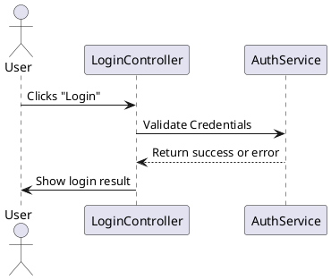
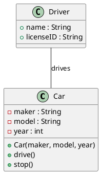
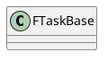

```plantuml
@startuml
actor User
participant "LoginController" as LC
participant "AuthService" as AS

User -> LC: Clicks "Login"
LC -> AS: Validate Credentials
AS --> LC: Return success or error
LC -> User: Show login result
@enduml
```

 

```plantuml
@startuml
' 定义一个类
class Car {
    -maker : String
    -model : String
    -year : int
    
    +Car(maker, model, year)
    +drive()
    +stop()
}

' 定义另一个类
class Driver {
    +name : String
    +licenseID : String
}

' 定义关系：Driver "1" -- "1..*" Car : owns >
Driver -- Car : drives
@enduml
```

 

```plantuml
@startuml
class FTaskBase{

}


@enduml
```

 

```plantuml
@startuml

class 
@enduml
```

